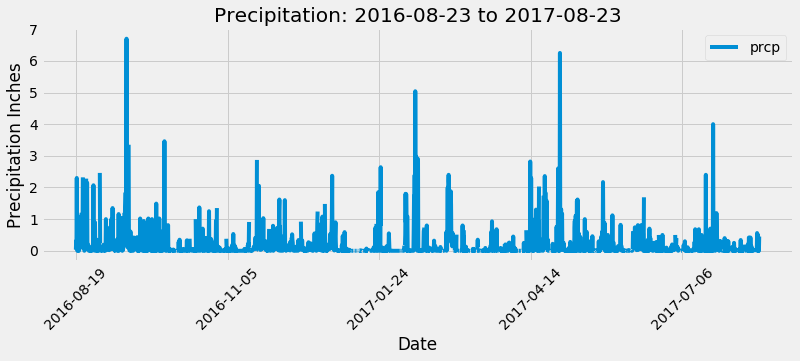
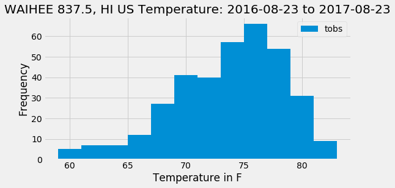

# Climate Analysis and Exploration!
-  All data was drawn from the hawaii.sqlite database to make find the following information

# Precipitation Analysis
-
- Designed a query to calculate the total number of stationn and the most active stations.
- Percipitation over the last year of the data for station 7 (most active) is shown in this plot below

# Station Analysis
- Designed a query to calculate the total number of stations.
- Designed a query to find the most active stations.
- List the stations and observation counts in descending order.
- Data can be shown in the histrogram below. 

# Climate App
- Created a climate app via python which lists all available routs on the home page
